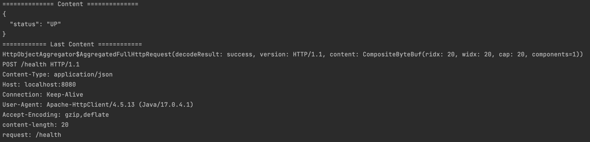

# Overview

Netty : 서버/클라이언트 기반의 NIO 네트워크 프로토콜

위 Repository는 Netty와 Kotlin을 공부하기 위한 용도입니다

# Usage

## Execute Jar

```
java -jar -Dport=80 ./build/libs/Netty-1.0-SNAPSHOT.jar
```

> port를 기재하지 않을 시 기본 포트인 8080을 사용합니다.

## Run Docker

```
docker build -t netty-server .
docker run -p 80:8080 netty-server
```

## Request : http://localhost:8080/health

# Example



위와같이 Content Body정보 및 Header정보를 Console을 통해 확인할 수 있습니다.

HttpMessage로 집계할 수 있는 Body의 사이즈는 1KB로 설정되어 있습니다. 

> HttpObjectAggregator를 통해 AggregatedFullHttpRequest로 Convert된다. 기본은 HttpDefaultRequest

# Study

## Word

* Manifest : Jar파일의 버전, 메인클래스, 이름 등의 메타데이터를 가지고 있는 명세파일이다
* Plain Jar : 단순하게 컴파일된 class파일과 java파일이 패키징된 파일이다
* Executable Jar : 메인클래스가 있는 패키지를 기준으로 하위 디렉토리에 있는 모든 class의 classpath가 잡혀있는 상태로 패키징 된 실행가능한 Jar파일이다
* Fat Jar : 외부 라이브러리까지 classpath가 잡혀있어 함께 패키징 된 Jar파일이다

## Gradle

```groovy
jar {
    manifest {
        attributes ('Main-Class': 'com.yunseong.netty.NettyApplicationKt')
    }

    from {
        configurations.compileClasspath.collect {
            it.isDirectory() ? it : zipTree(it)
        }
    }

    duplicatesStrategy = DuplicatesStrategy.EXCLUDE
}
```
1. Manifest의 MainClass를 지정하여 Executable Jar로 패키징 준비
2. 패키징 하기 전 compile단게에서 사용하는 외부 라이브러리들에 대한 classpath를 ZipTree를 통해 jar파일에서 Tree모델로 구조화
3. from task를 통해 Tree로 구조화된 파일을 패키징 될 jar파일 내부로 복사한다
